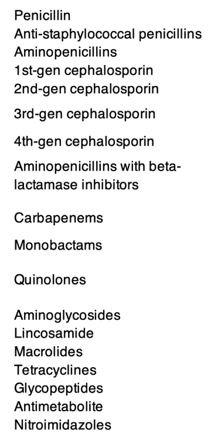
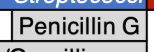
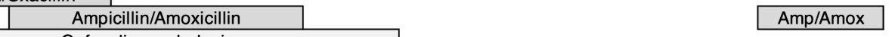

take at a look at @references/antibiogram.jpg 
I want to make a game to help memorize this table.

context: 
The top bar  shows a list of germs.
the side bar shows the different antibiotics groups: 
The actual antibiotics are the cells in the table, like: , and .

essentially what the table tells us is for each germ (columns), which antibiotics are effective (cells), and from what family they are (rows).

The game:
Build the table structure with the top bar and the side bar. In each tern, you will get a random antibotic, and you will need to drag and drop it to the right cell (or cells) in the table.

Note: if the antibiotic fits more than one germ, split into multiple blocks, one for each germ. they will all be shown in the same round. progress to the next round when all you place all the blocks. the correctness check happens for each block seperately (see note below on what to do when correct and what to do when incorrect).

Extra features of the game for the user experience:
when you are right, have a celebration
when you are wrong, show the correct location for it, without being over-dramatic with the "you lost" messageing, make it feel like you still did ok. Also, after you show the right location, give an option to continue or to try again.
Show blockes you placed correctly with a full outline, and those you got wrong with a dashed outline. 
put a counter in the top showing how many more antibiotics are left to go.
have a skip button that allows you to see the answers so that it isn't too furstrating.
have an "end" button always available so that you can stop at any time. When you end the game you will get a % of how many you got right out of the total you got (NOT the total number of antibiotics available in the game). also always show the numbers themselves, and show a "more details" button. when clicking that button you will see a log of the mistakes you made - where you placed it and where it should have been. next to each mistake, have a counter to show how many times you made that mistake, so that the player may detect patterns.
if the grade is lower than 60, don't show a numerical grade, just show the breakdown + the more details thingy.

take a look at the note below: 
for now, make sure to keep it as is in the interface, but in the future we may try to integrate what it says directly into the experience. suggest how we might do that.

for future work - IGNORE for now:
- find a way to help memorize - maybe menemonics or something? think of how to show this in the interface.